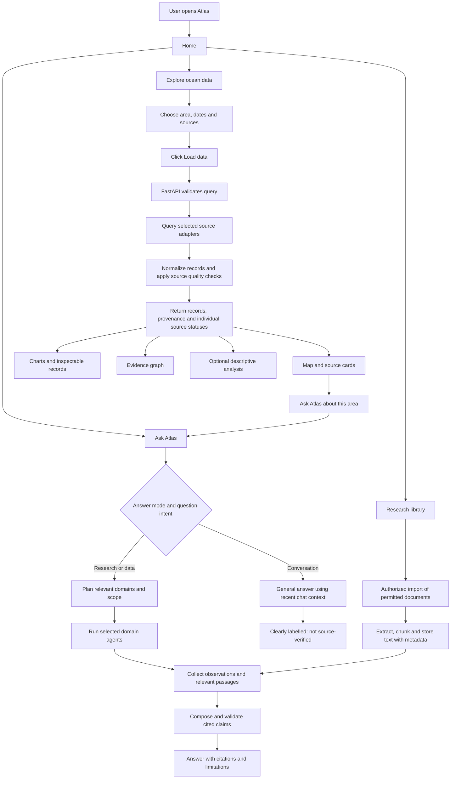
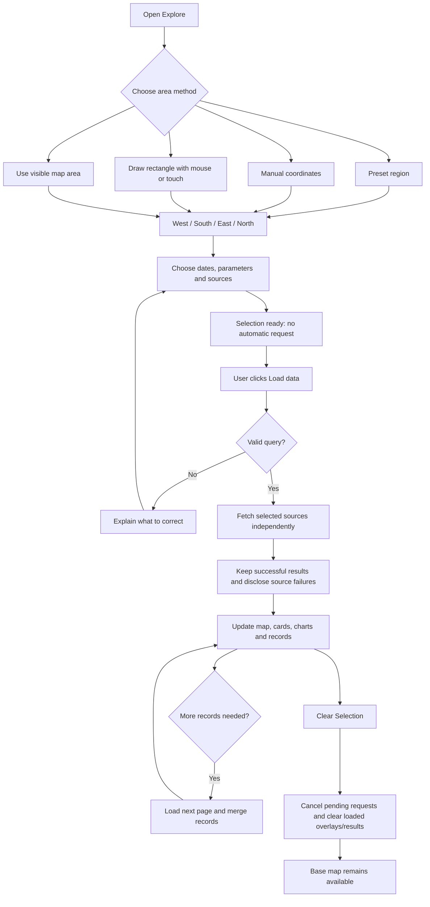
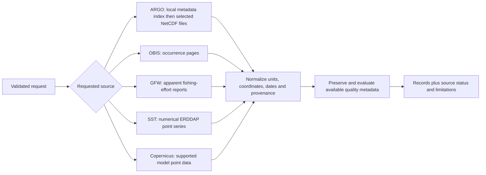
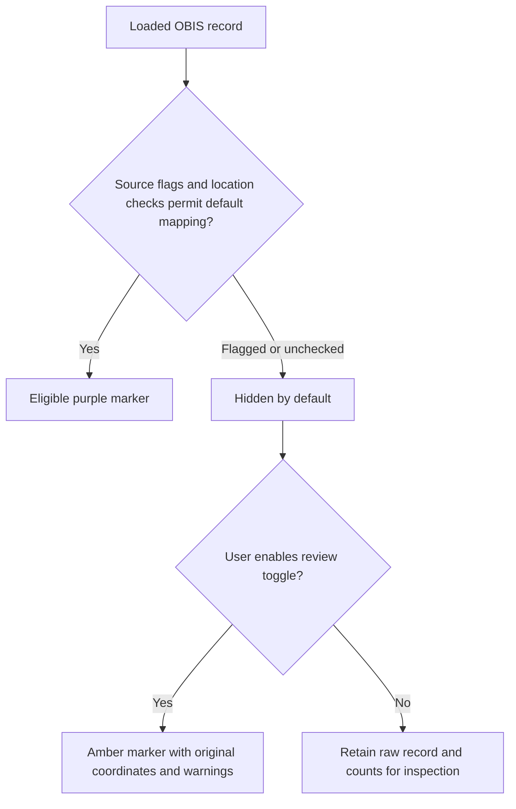
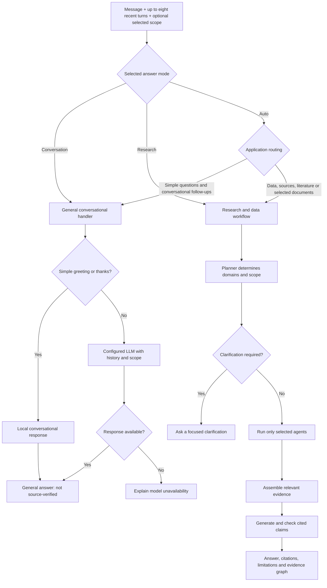
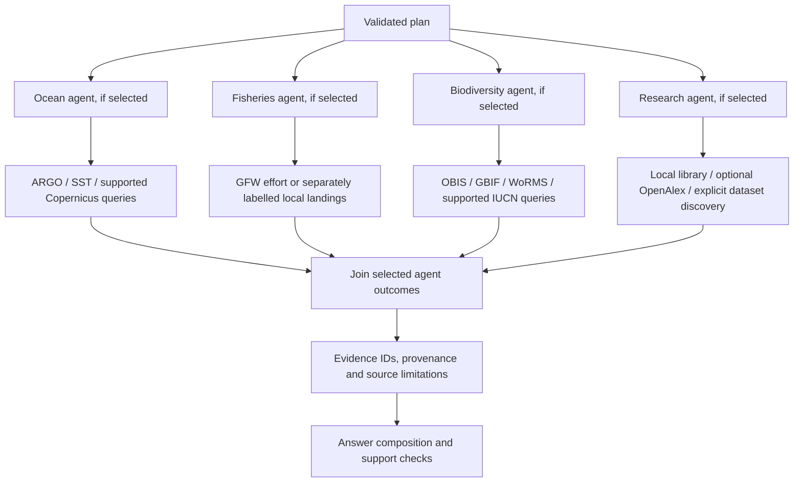
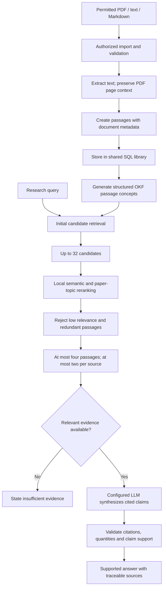
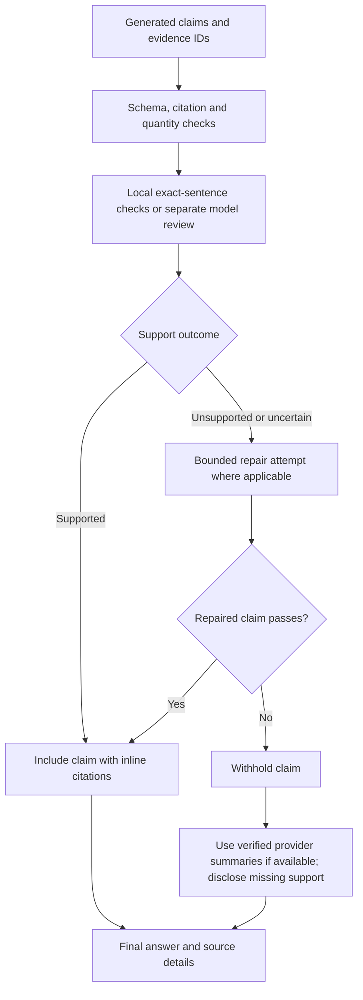
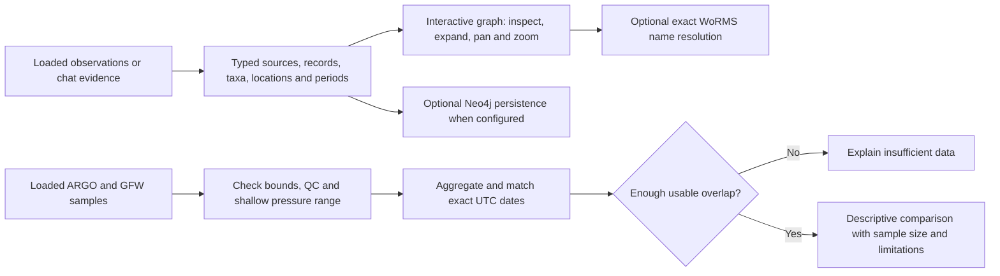

# Project Atlas workflow

This describes the current MVP. Optional integrations require configuration; an unavailable source is reported rather than replaced with invented data.

## 1. Overall platform

The library connection above represents later retrieval from stored passages, not automatic transmission of every imported document to the model.

## 2. Map exploration

- OBIS can use all recorded dates or the selected observation period.
- ARGO file discovery is paginated; a file can contain several profiles or no usable profiles after QC.
- A page size is not the total number of observations in the ocean.
- Map rendering is capped at 2,000 eligible loaded locations. Source totals, retrieved counts and displayed counts are different.

## 3. Source retrieval and quality

OBIS map eligibility:

If all loaded locations have `ON_LAND` flags, the card says **Locations flagged on land**. This relies on source QC; it is not an independent coastline survey. Occurrences include many taxa and do not measure fish abundance.

Charts use valid numerical rows, remove exact duplicate chart series and omit series with fewer than two points. The overview shows the widest loaded pressure range per float and measurement; other distinct profiles remain expandable. ARGO charts show value against pressure, not change over time.

## 4. Ask Atlas: conversation or evidence

Auto routing is heuristic. The user can choose Research to request retrieved evidence explicitly. Conversation mode does not query data tools or selected papers, even if a geographic scope is present. Selected scope is context, not proof of current conditions.

## 5. Agent orchestration

LangGraph coordinates these bounded workflows. These are specialized application agents, not four independently trained models. Provider failures remain visible; successful evidence can still be used. NASA/NOAA catalog discovery returns metadata, not automatically downloaded scientific measurements.

## 6. Research library and RAG

Current retrieval uses OKF/BM25 candidate discovery followed by local semantic reranking with `BAAI/bge-base-en-v1.5`. The alternative hybrid path combines lexical and vector retrieval. OKF is a structured knowledge format, not a replacement language model. Local reranking does not require sending passages to a cloud model; synthesis and model-based support review can send selected passages externally.

## 7. Answer validation and fallback

Citation checks and model review are fallible safeguards, not proof of scientific truth. A failed literature synthesis must not be presented as a successful answer by substituting unrelated raw passages.

## 8. Graph and analytics

The graph records provenance and explicit relationships, not causal discoveries. The ARGO/GFW analysis uses shallow 0–10 dbar measurements and needs at least three overlapping dates; constant series do not yield a useful correlation. Fishing effort is not catch, and association does not establish mortality, population decline or causation.

## 9. Five-step presentation version

1. **Choose a question or area.** Use plain-language chat or geographic selection.
2. **Retrieve relevant evidence.** Query only the required providers and library passages.
3. **Check and organize it.** Preserve provenance, quality flags, relevance and limitations.
4. **Explain and visualize it.** Show maps, profiles, source records, graphs and appropriately labelled answers.
5. **Let the user investigate further.** Follow citations, load more records, inspect warnings or ask a follow-up.

**Presentation sentence:** Project Atlas connects a user's question or selected ocean area to relevant data and literature, then presents understandable results with traceable sources and explicit limits.

## 10. Operational boundary

- Frontend: React/TypeScript/Vite, normally on port 3000.
- Backend: FastAPI/Uvicorn, normally on port 8000.
- Default persistence: `backend/atlas-local.db`; ARGO discovery uses a separate metadata index.
- The current local research library contains 11 document entries and 674 chunks, as checked on 30 September 2026.
- External provider availability, credentials and model reliability affect results.
- eDNA and otolith workflows currently support metadata and limited validation, not automated species or image classification.
- Forecasting, exhaustive global ingestion and production multi-user infrastructure are outside this MVP workflow.

For full architecture, setup, API details and limitations, see [PROJECT_ATLAS_COMPLETE_GUIDE.txt](PROJECT_ATLAS_COMPLETE_GUIDE.txt).
